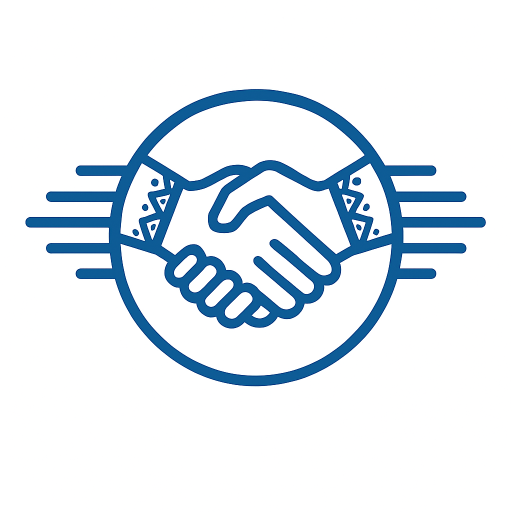
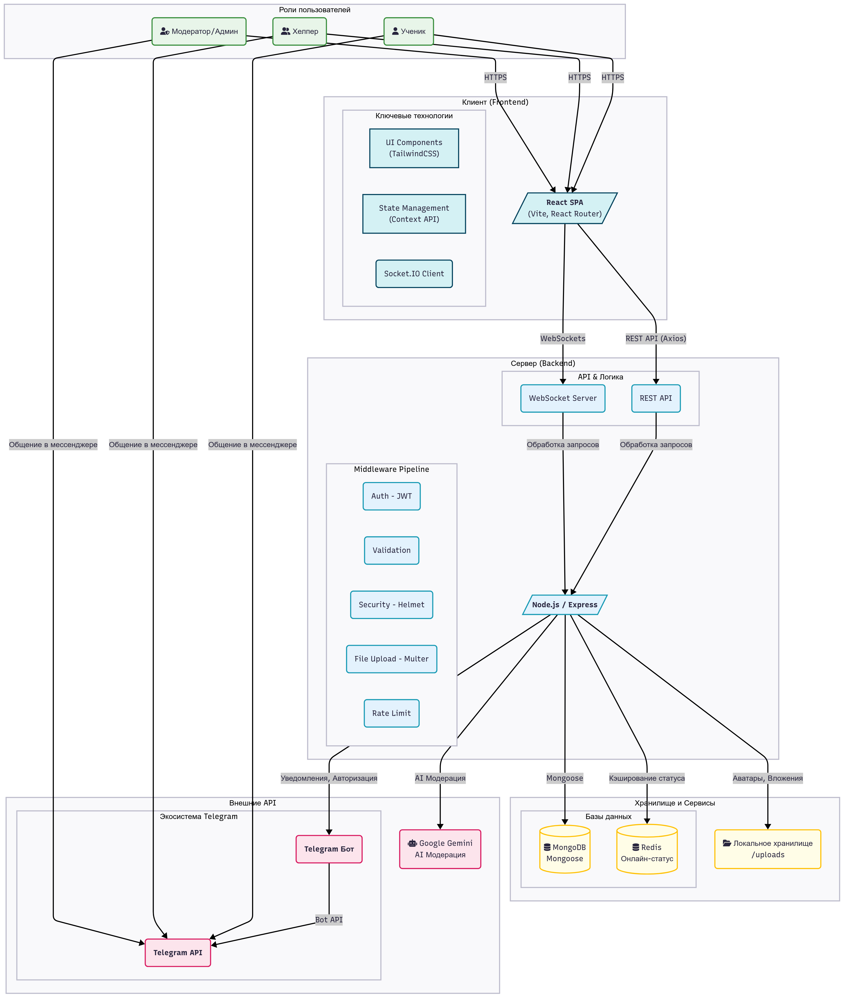

<div align="center">
  
</div>

# Платформа взаимопомощи для школьников «Бірге Көмек»

## О проекте

**«Бірге Көмек»** (каз. "Поможем вместе") — это EdTech веб-платформа, созданная для формирования сообщества, где школьники могут помогать друг другу с учебой, обмениваться знаниями и получать помощь по различным академическим дисциплинам.

Основная цель проекта — предоставить удобный и безопасный инструмент для peer-to-peer (ученик-ученику) обучения, повысить академическую успеваемость и развить у учащихся чувство взаимопомощи.

## Технологический стек

Проект построен на базе современного стека **MERN** с добавлением технологий для работы в реальном времени:

-   **Фронтенд:**
    -   **React.js:** Библиотека для создания пользовательских интерфейсов.
    -   **Tailwind CSS:** Утилитарный CSS-фреймворк для быстрой и современной стилизации.
    -   **React Router:** Для навигации по одностраничному приложению (SPA).
    -   **Axios:** Для выполнения HTTP-запросов к бэкенду.
    -   **Socket.io-client:** Для подключения к WebSocket-серверу и работы чата в реальном времени.

-   **Бэкенд:**
    -   **Node.js:** Среда выполнения JavaScript на сервере.
    -   **Express.js:** Веб-фреймворк для создания API.
    -   **MongoDB:** NoSQL база данных для хранения информации о пользователях, заявках и сообщениях.
    -   **Mongoose:** Библиотека для моделирования объектов для MongoDB.
    -   **Socket.io:** Для организации двунаправленной связи в реальном времени (чаты, уведомления, онлайн-статус).
    -   **JSON Web Token (JWT):** Для безопасной аутентификации пользователей.
    -   **Telegram API:** Для интеграции с ботом (аутентификация, уведомления).
    -   **Cloudinary:** Для облачного хранения и быстрой доставки файлов (аватары, вложения).

## Архитектура проекта

Ниже представлена общая схема архитектуры платформы, показывающая взаимодействие ключевых компонентов:

<div align="center">
  
</div>

## Ключевые возможности

-   **Система ролей:** Пользователи делятся на Учеников, Хелперов, Модераторов и Администраторов с разными правами доступа.
-   **Заявки на помощь:** Ученики могут создавать заявки с описанием проблемы, прикреплять файлы.
-   **Система откликов:** Хелперы могут откликаться на заявки, предлагая свою помощь.
-   **Чат в реальном времени:** После принятия отклика между учеником и хелпером создается приватный чат для обсуждения деталей.
-   **Рейтинг и отзывы:** После выполнения заявки ученик может оставить отзыв и поставить оценку хелперу.
-   **Профиль пользователя:** С информацией о пользователе, его рейтинге и истории активности.
-   **Интеграция с Telegram:** Возможность входа и регистрации через Telegram, а также получение уведомлений.
-   **Защита от входа с нового IP:** При обнаружении входа с нового, не доверенного устройства, система запрашивает код подтверждения, отправленный в Telegram пользователя, для предотвращения несанкционированного доступа.
-   **Палитра команд (Command Palette):** Быстрый доступ ко всем основным функциям сайта через удобное меню, вызываемое по `Cmd/Ctrl + J`.


## Ключевые отличия от аналогов (Znanija.com, Brainly)

Хотя существуют глобальные платформы для вопросов и ответов, «Бірге Көмек» предлагает ряд уникальных преимуществ, ориентированных на качество и безопасность:

1.  **Фокус на процессе, а не на результате.** Платформа, благодаря встроенной ИИ-модерации, пресекает попытки просто "сдать" задание, отклоняя заявки с формулировками "решите за меня". Цель — помочь разобраться в теме, а не получить готовый ответ.
2.  **Управляемая среда и безопасность.** Внедрены несколько уровней защиты:
    *   **Анти-чит система:** Обнаруживает подозрительную активность и мультиаккаунты.
    *   **Автомодерация:** Анализирует все заявки на предмет ненормативной лексики, запрещенных тем и попыток обмана.
    *   **Рейтинговая система:** Мотивирует хелперов давать качественные ответы и помогает ученикам выбирать проверенных помощников.
3.  **Прямой контакт и совместная работа.** В отличие от формата "вопрос-ответ", платформа создает приватный чат между учеником и хелпером. Это позволяет вести полноценный диалог, задавать уточняющие вопросы и совместно работать над задачей в реальном времени.
4.  **Глубокая интеграция с Telegram.** Полноценная экосистема с кастомизированными уведомлениями, кнопками для быстрых действий и двухфакторной аутентификацией для критически важных действий модераторов.

## Безопасность

Безопасность пользователей и данных — ключевой приоритет проекта. Реализованы следующие меры защиты:

-   **Аутентификация и авторизация:**
    -   Для доступа к защищенным маршрутам используется механизм JSON Web Token (JWT). Токены имеют короткое время жизни для минимизации рисков.
    -   Реализована строгая система ролей (RBAC), где каждый API-endpoint проверяет права пользователя (ученик, хелпер, модератор).
-   **Защита от атак:**
    -   Все входящие данные проходят валидацию и очистку для предотвращения XSS и NoSQL-инъекций.
    -   Установлены лимиты на частоту запросов (rate limiting) для защиты от DDoS-атак и брутфорса.
    -   Пароли пользователей не хранятся в системе (используется только аутентификация через Telegram), что исключает риски их утечки.
-   **Конфиденциальность данных:**
    -   Чаты между пользователями являются приватными.
    -   Все чувствительные данные, такие как ключи API и секреты, хранятся в переменных окружения (`.env`) и не попадают в систему контроля версий.

## Реальные кейсы использования

1.  **Срочная помощь перед контрольной.**
    *   **Пользователь:** Алия, 9 класс.
    *   **Ситуация:** Через час контрольная по алгебре, Алия не понимает, как решать уравнения с модулем.
    *   **Действия:** Она создает заявку на «Бірге Көмек», прикрепляет фото примера. Через 3 минуты откликается хелпер Данияр. В приватном чате он объясняет ей алгоритм решения, отвечает на вопросы. Алия успешно пишет контрольную.

2.  **Помощь и заработок рейтинга.**
    *   **Пользователь:** Тимур, 11 класс, хорошо знает физику.
    *   **Ситуация:** Тимур хочет укрепить свои знания и получить хороший рейтинг.
    *   **Действия:** Он заходит в ленту заявок и видит вопрос по закону Ома. Он берет заявку, подробно расписывает решение и объясняет концепцию. Ученик оставляет ему положительный отзыв и оценку 5/5.

## Инструкция по локальному запуску

Для запуска проекта на вашем компьютере выполните следующие шаги:

### 1. Предварительные требования

-   У вас должен быть установлен [Node.js](https://nodejs.org/) (рекомендуется версия v18.x или выше).
-   У вас должен быть запущен экземпляр [MongoDB](https://www.mongodb.com/try/download/community).

### 2. Клонирование репозитория

```bash
git clone https://github.com/Flaymie/BirgeKomek
cd BirgeKomek
```

### 3. Настройка бэкенда

```bash
# Перейдите в папку с бэкендом
cd backend

# Установите зависимости
npm install

# Создайте файл .env на основе примера .env.example
# и заполните его вашими данными (строка подключения к MongoDB, JWT-секрет и т.д.)
cp .env.example .env
```
Откройте файл `.env` в текстовом редакторе и укажите необходимые параметры.

### 4. Настройка фронтенда

```bash
# Вернитесь в корень проекта и перейдите в папку с фронтендом
cd ../frontend

# Установите зависимости
npm install
```
Фронтенд не требует дополнительных файлов конфигурации, он будет подключаться к бэкенду по адресу, указанному в `proxy` в файле `package.json`.

### 5. Запуск проекта

Вам нужно будет запустить два процесса в двух разных терминалах.

**В первом терминале (для бэкенда):**

```bash
# Убедитесь, что вы в папке /backend
npm start
```

## Лицензия

**Автор:** Владимир (Flaymie) ([https://github.com/Flaymie](https://github.com/Flaymie))  

Этот проект распространяется под лицензией [MIT](LICENSE).